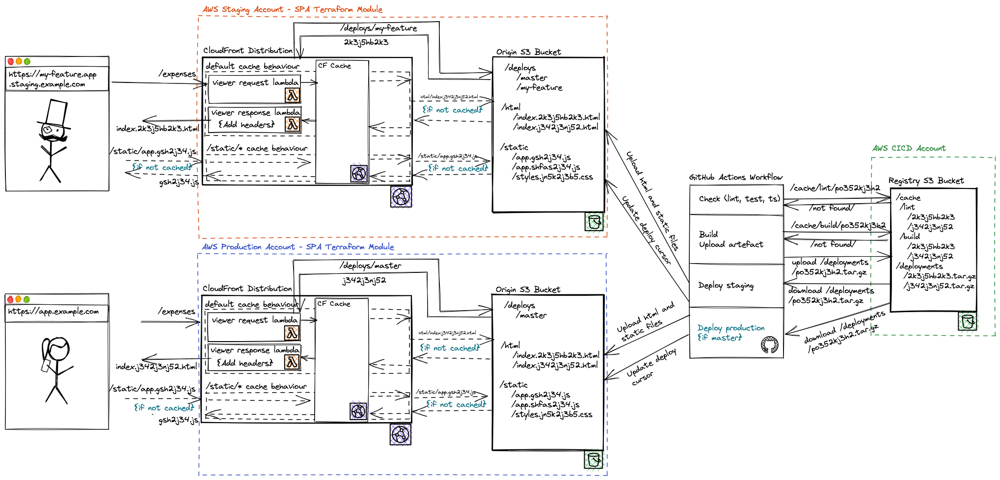

<h1 align="center">
  🔋 Frontend Infrastructure
</h1>

💡 A collection of reusable software components which can be used to build a complete CI/CD and serving infrastructure for a Single Page Application using GitHub Actions and AWS.

👨‍🔧 This repo is lovingly stewarded by Pleo Frontend Ops.

🐛 Issues should be reported [in the repo](https://github.com/pleo-io/frontend-infrastructure/issues) or via [Stewards: Frontend Infrastructure](https://linear.app/pleo/project/stewards-project-web-eaf888bda3d6) project on Linear (if you have access)

Components available:

- [Custom GitHub Actions](/actions)
- [Reusable GitHub Workflows](/workflows)
- [Lambda@Edge Functions](/edge-lambdas)

## Architecture Overview

The delivery pipeline consists of 4 main parts:

- AWS CloudFront distribution with Lambda@Edge functions triggered on certain requests (one per environment served)
- Origin AWS S3 bucket which stores the static files for the SPA (one per environment served)
- CI/CD pipeline using GitHub Actions
- Registry S3 bucket which supports the CI/CD pipeline serving as artifact registry and cache storage

## Properties

- The exact same mechanism for serving master branch as for feature branches (i.e. production vs previews)
- Optimal CDN caching and latency - static assets are cached indefinitely and served directly from CDN cache with no edge computing in path
- Preview links available for each commit and each branch, available in PR UI

- Only run the bundling once, not once per environment
- CI runs for each state of the repo only once (e.g. no need to rerun tests on master after PR merge if the code was already tested)
- Easy to follow and understand the state of the pipeline in GitHub Actions
- No need for custom authentication (e.g. PATs, GH apps) beyond what GitHub injects into actions
- Instant rollback available from within GitHub UI
- Rollback blocks automatic deployments for the rolled back environment, with an ability to unblock the pipeline from GitHub UI
- Only one concurrent build per branch at any time, with safe cancellation of the previous build

## Detailed View

In full detail, a delivery pipeline supporting two environments can be illustrated like so:

