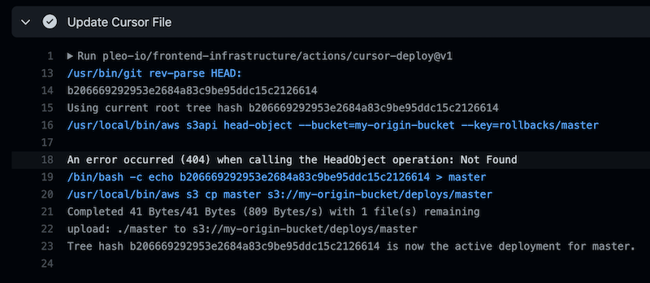

# Cursor Deploy Action



Performs a deployment by updating a cursor file in an S3 bucket. This relies on infrastructure that
uses the cursor files to serve the correct markup to the user.

## Inputs

| Name                 | Description                                                               | Type     | Default   | Required |
| -------------------- | ------------------------------------------------------------------------- | -------- | --------- | :------: |
| bucket_name          | Name of the S3 bucket to use for deployments                              | `string` | n/a       |   yes    |
| deploy_mode          | The deployment mode (default/rollback/unblock)                            | `string` | 'default' |    no    |
| rollback_commit_hash | Commit hash to roll back to to, defaults to previous commit on the branch | `string` | n/a       |    no    |

## Outputs

| Name      | Description                        |
| --------- | ---------------------------------- |
| tree_hash | The tree hash of the code deployed |

## Example usage

```yml
- name: Update the cursor file
  id: deployment
  uses: 'pleo-io/frontend-infrastructure/actions/cursor-deploy@v1'
  with:
      bucket_name: my-s3-bucket
```

## Rollbacks

The action supports rollbacks with blocking of automatic deployments until an explicit action is
taken to undo the rollback. You can create a rollback and unblock GitHub workflows triggered via
repository dispatch.

```yml
- name: Update the cursor file
  uses: 'pleo-io/frontend-infrastructure/actions/cursor-deploy@v1'
  with:
      bucket_name: my-s3-bucket
      deploy_mode: 'rollback'
      rollback_commit_hash: ${{ github.event.inputs.sha }}
```

```yml
- name: Update the cursor file
  uses: 'pleo-io/frontend-infrastructure/actions/cursor-deploy@v1'
  with:
      bucket_name: my-s3-bucket
      deploy_mode: 'unblock'
```
