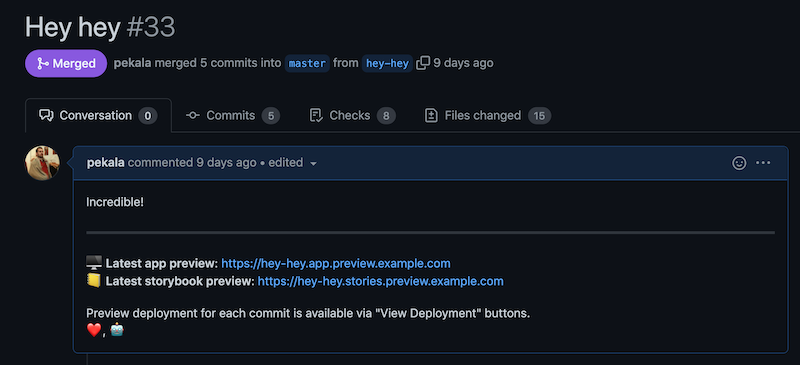

# Post preview URLs Action



Update PR description with the links to the latest preview deployment of that PR. Optionally, also
includes a link to storybook deployment.

## Inputs

| Name           | Description                                    | Type     | Default                                   | Required |
| -------------- | ---------------------------------------------- | -------- | ----------------------------------------- | :------: |
| token          | GitHub token used to update the PR description | `string` | n/a                                       |   yes    |
| app_domain     | The domain for the app deployments             | `string` | n/a                                       |   yes    |
| marker         | HTML comment marker for the appended content   | `string` | `<!--preview-urls-do-not-change-below-->` |  false   |
| stories_domain | The domain for the storybook deployments       | `string` | n/a                                       |  false   |

```yml
jobs:
    update-pr-desc:
        name: Post Preview URLs to PR Description
        runs-on: ubuntu-20.04
        permissions:
            contents: read
            pull-requests: write
        steps:
            - uses: actions/checkout@v2
            - uses: 'pleo-io/frontend-infrastructure/actions/post-preview-urls@v1'
              with:
                  token: ${{ secrets.GITHUB_TOKEN }}
                  app_domain: my-app.preview.example.com
                  stories_domain: my-app-stories.preview.example.com
```
