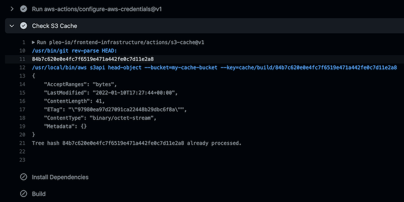

# S3 Cache Action



Allows to skip a job if it was already performed for the same repo state. Uses S3 for caching.

It will save a `cache/some-job/4ad9aaa5e05818045ed5d4916315511c1aaedccd` file in S3 (if
`4ad9aaa5e05818045ed5d4916315511c1aaedccd` is the current root git repo tree hash). Any time the
same job is run with the same state of the repository, you can avoid any work by checking the
`processed` output which will be set to `true`. This allows to e.g. safely skip work after merging
to the main branch, if the code was tested/linted/built on a feature branch.

Since GitHub action do not yet support early exits from jobs, you'll need to check the value of the
`processed` output of this action for every step in the job that you want to avoid.

Note that the action assumes that the AWS credentials has already been configured for the job. Use
the `configure-aws-credentials` action in a step prior to running this action to ensure that's the
case.

## Inputs

| Name        | Description                                          | Type     | Default | Required |
| ----------- | ---------------------------------------------------- | -------- | ------- | :------: |
| bucket_name | Name of the S3 bucket to use for storing cache files | `string` | n/a     |   yes    |
| key_prefix  | Key prefix to use for the cache files (e.g. job id)  | `string` | n/a     |   yes    |

## Outputs

| Name      | Description                                                                     |
| --------- | ------------------------------------------------------------------------------- |
| processed | Indicates if the job has already been performed for the current tree hash       |
| hash      | The git tree hash which was used for cache lookup (current repo root tree hash) |

## Example use

```yaml
- uses: aws-actions/configure-aws-credentials@v1
  with:
      aws-access-key-id: ${{ secrets.AWS_ACCESS_KEY_ID }}
      aws-secret-access-key: ${{ secrets.AWS_SECRET_ACCESS_KEY }}
- uses: 'pleo-io/frontend-infrastructure/actions/cursor-deploy@v1'
  id: s3-cache
  with:
      bucket_name: my-s3-bucket
      key_prefix: cache/some-job
- uses: bahmutov/npm-install@v1
  if: steps.s3-cache.outputs.processed == 'false'
```
